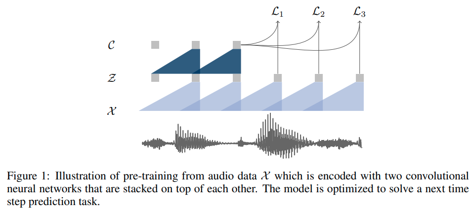
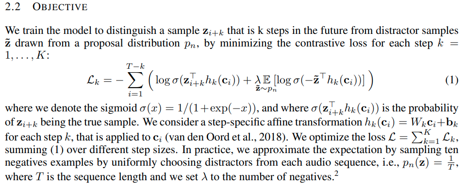

# wav2vec: Unsupervised Pre-training for Speech Recognition

[Paper](https://arxiv.org/abs/1904.05862) | [Project page](https://ai.meta.com/blog/wav2vec-unsupervised-speech-recognition-without-supervision/) | [Code](https://github.com/facebookresearch/fairseq/tree/main/examples/wav2vec/unsupervised)

_Given an audio signal as input, we optimize our model to predict future samples from a given
signal context._

_Our model takes raw audio signal as input and then applies two networks. The encoder_ (convolutional) _network embeds
the audio signal_ (about 30 ms with stride 10 ms) _in a latent space_ (low frequency feature representation) _and the
context network_ (convolutional) _combines multiple time-steps of the encoder_ (210 ms total) _to obtain contextualized 
representations (Figure 1). Both networks are then used to compute the objective function._

_After training, we input the representations produced by the context network to the acoustic model
instead of log-mel filterbank features._
