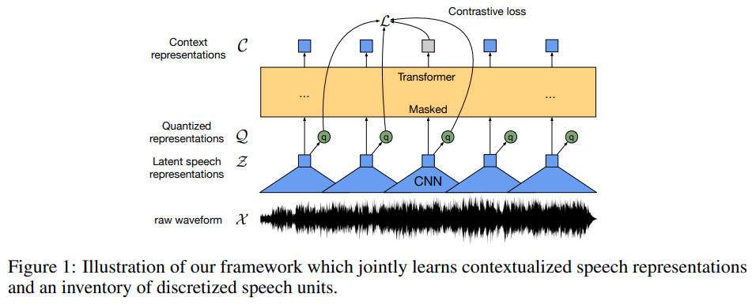

# wav2vec 2.0: A Framework for Self-Supervised Learning of Speech Representations

[Paper](https://arxiv.org/abs/2006.11477) | [Project page](https://ai.meta.com/blog/wav2vec-20-learning-the-structure-of-speech-from-raw-audio/) | [Code](https://github.com/facebookresearch/fairseq/blob/main/examples/wav2vec/README.md)

## Model

_Our model is composed of a multi-layer convolutional feature encoder which takes as input raw audio X and outputs 
latent speech representations for T time-steps. They are then fed to a Transformer to build_ (contextualized) 
_representations capturing information from the entire sequence. The output of the feature encoder is discretized to q 
with a_ (product) _quantization module to represent the targets (Figure 1) in the self-supervised objective_ 
(as codebooks). [...] _our model builds context representations over continuous speech representations and 
self-attention captures dependencies over the entire sequence of latent representations end-to-end._

## Training

_To pre-train the model we mask a certain proportion of time steps in the latent feature encoder space, similar to 
masked language modeling in [BERT](./1810.04805-BERT-Pre--training-of-Deep-Bidirectional-Transformers-for-Language-Understanding.md).
The training objective requires identifying the correct quantized latent audio representation in a set of distractors 
for each masked time step and the final model is fine-tuned on the labeled data._

_During pre-training, we learn representations of speech audio by solving a contrastive task which requires to identify 
the true quantized latent speech representation for a masked time step within a set of distractors. This is augmented 
by a codebook diversity loss to encourage the model to use the codebook entries equally often._
