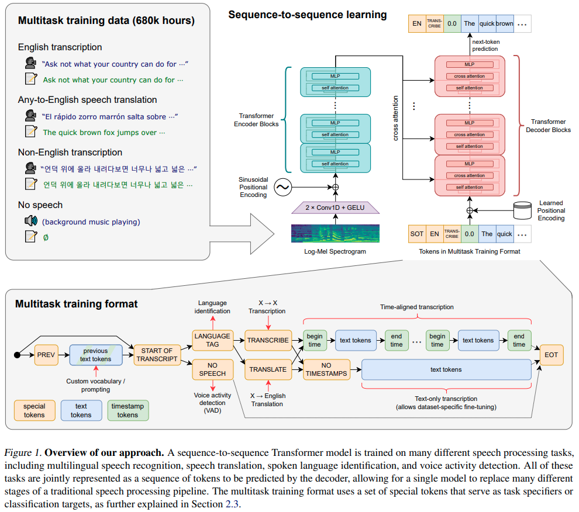

# Robust Speech Recognition via Large-Scale Weak Supervision

[Paper](https://cdn.openai.com/papers/whisper.pdf) | [Project page](https://openai.com/research/whisper) | [Code](https://github.com/openai/whisper)

Authors use 680,000 hours of labeled data scrapped from the internet. 117,000 hours covering 96 languages and 125,000 
hours of X to english translation data.

[...] _we train Whisper models to predict the raw text of transcripts without any significant standardization, relying 
on the expressiveness of sequence-to-sequence models to learn to map between utterances and their transcribed form._ 
[...] _We construct the dataset from audio that is paired with transcripts on the Internet._

_Since the focus of our work is on studying the capabilities of large-scale supervised pre-training for speech 
recognition, we use an off-the-shelf_ (encoder-decoder Transformers) _architecture to avoid confounding our findings 
with model improvements._

Authors use multitask training format with the following tasks: transcription, translation, voice activity detection,
alignment, and language identification.

